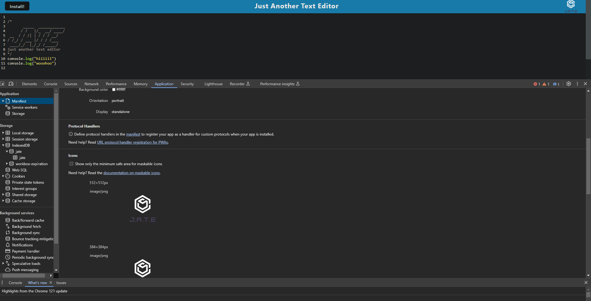
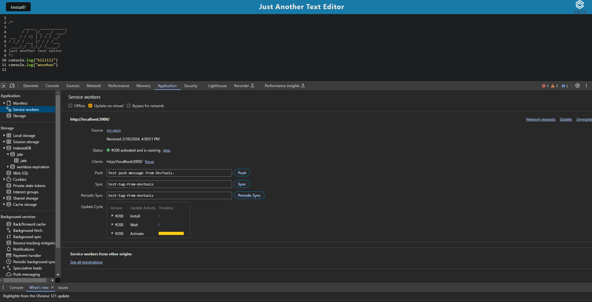
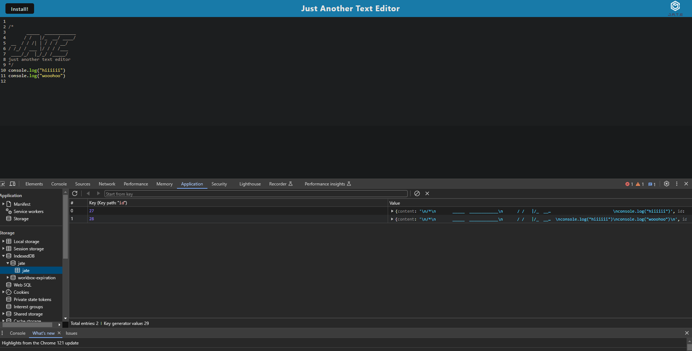

# Text Editor Starter Code

# Description

This application is a text editor that runs in browser. Users may create notes or code snippets without internet connection so that they can reliably retrieve them for later use.

# Installation 

To run locally, user can clone repo, then install necesssary packages by entering `npm i` in the terminal. Appplication can be started by entering `npm start` in the terminal. Url for app will run on localhost:3000.

# Usage

Here is a link to the [Deployed Application]().

Showing manifest 

Showing service worker

Showing IndexDB

# Credit

Link to [Starter Code](https://github.com/coding-boot-camp/cautious-meme).